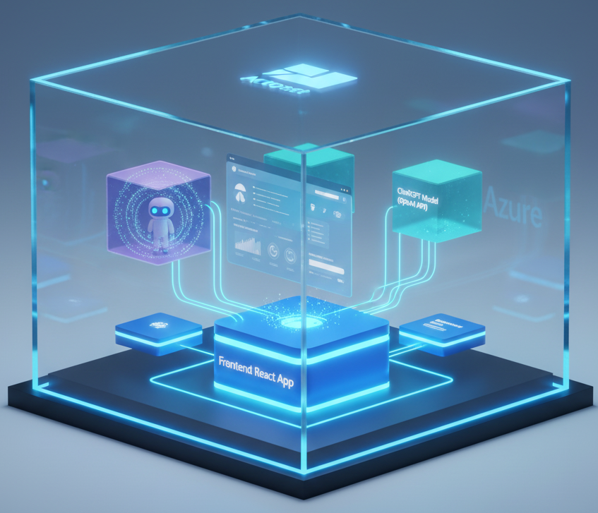
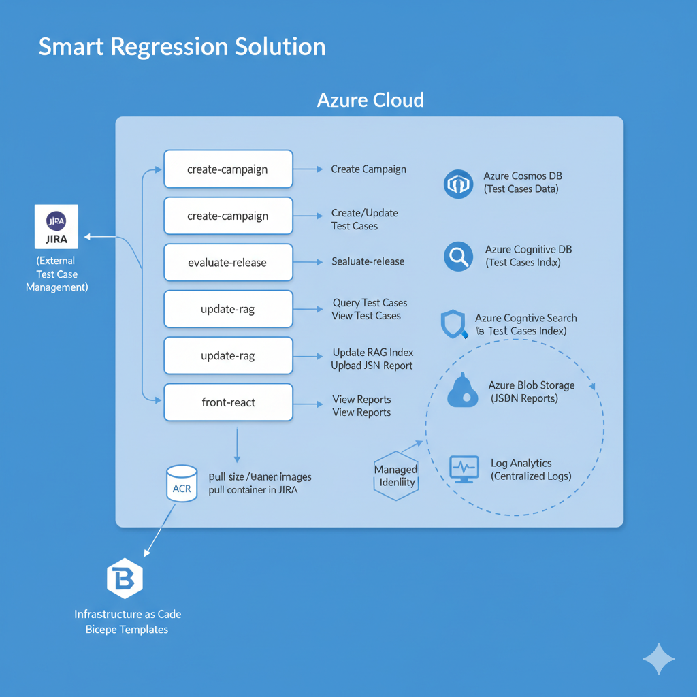

# 🚀 Smart Regression Solution




## 📦 Overview

Smart Regression is an end-to-end Azure-based solution for automated regression test management, evaluation, and reporting. It leverages Azure Container Apps, Azure Storage, Cosmos DB, Cognitive Search, and integrates with JIRA for test case management. The solution includes backend APIs, scheduled jobs, and a React frontend for user interaction.

---

## 🏗️ Solution Structure

```
.
├── apps/
│   ├── create-campaign/      # API to create JIRA test cases from JSON
│   ├── evaluate-release/     # API to evaluate a release and generate results
│   ├── front-react/          # React frontend for evaluation and results
│   └── update-rag/           # Scheduled job to update regression data
├── infra/                    # Bicep IaC for Azure resources and secrets
├── shared/                   # Shared Python utilities and Azure clients
└── README.md                 # This file
```

---

## 🎯 Goal

- **Automate regression test management**: Create, evaluate, and update test cases using APIs and scheduled jobs.
- **Integrate with JIRA**: Sync test cases and results with your JIRA instance.
- **Centralize data**: Store and index test cases in Azure Cosmos DB and Cognitive Search.
- **Provide a user-friendly frontend**: Allow users to trigger evaluations and view results.

---

## 🧩 Components

### 1. **Create Campaign API** ([apps/create-campaign](apps/create-campaign/README.md))
- **Tech:** FastAPI, Python
- **Purpose:** Accepts JSON input to create test cases in JIRA.
- **Endpoints:** `/create`
- **Dockerized:** Yes

### 2. **Evaluate Release API** ([apps/evaluate-release](apps/evaluate-release/README.md))
- **Tech:** FastAPI, Python
- **Purpose:** Evaluates a release by querying Cosmos DB and Azure Search, generates a JSON report, and uploads it to Azure Blob Storage.
- **Endpoints:** `/evaluate`
- **Dockerized:** Yes

### 3. **Update RAG Job** ([apps/update-rag](apps/update-rag/README.md))
- **Tech:** Python, Azure Functions base image
- **Purpose:** Scheduled job (cron) to fetch test cases from JIRA, update Cosmos DB, and index results in Azure Cognitive Search.
- **Dockerized:** Yes

### 4. **Frontend React App** ([apps/front-react](apps/front-react/README.md))
- **Tech:** React, Vite, NGINX
- **Purpose:** UI for users to trigger evaluations and view test case results.
- **Dockerized:** Yes

### 5. **Infrastructure as Code** ([infra](infra))
- **Tech:** Bicep
- **Purpose:** Deploys all Azure resources, secrets, and container apps.

### 6. **Shared Utilities** ([shared](shared))
- **Tech:** Python
- **Purpose:** Common Azure client factories and utility functions for all apps.

---



---

## 🔗 Azure Resources

- **Azure Container Apps**: Hosts APIs and jobs.
- **Azure Container Registry (ACR)**: Stores container images.
- **Azure Cosmos DB**: Stores test case data.
- **Azure Cognitive Search**: Indexes test cases for fast querying.
- **Azure Blob Storage**: Stores generated JSON reports.
- **Managed Identity**: Secures resource access.
- **Log Analytics**: Centralized logging.

---

## 🛠️ Deployment

1. **Provision Azure resources**  
   Use the Bicep files in [infra/](infra) to deploy all required resources:
   ```sh
   az deployment group create \
     --resource-group <your-rg> \
     --template-file infra/main.bicep \
     --parameters @infra/parameters/dev.parameters.json
   ```

2. **Build and push Docker images**  
   Build each app and push to ACR:
   ```sh
   docker build -t <acr>.azurecr.io/create-campaign:latest apps/create-campaign
   docker build -t <acr>.azurecr.io/evaluate-release:latest apps/evaluate-release
   docker build -t <acr>.azurecr.io/update-rag:latest apps/update-rag
   docker build -t <acr>.azurecr.io/front-react:latest apps/front-react
   docker push <acr>.azurecr.io/<app>:latest
   ```

3. **Deploy container apps**  
   Container Apps are deployed via Bicep modules in `main.bicep`.

---

## ⚙️ Configuration

- **Secrets and environment variables** are managed via Azure Managed Environments and referenced in Bicep files ([infra/infra-secrets.bicep](infra/infra-secrets.bicep)).
- **Frontend `.env` example** ([apps/front-react/README.md](apps/front-react/README.md)):
  ```env
  REACT_APP_EVALUATE_API=https://<your-api-evaluate>.azurecontainerapps.io/evaluate
  REACT_APP_JSON_URL=https://<your-storage>.blob.core.windows.net/<container>/result.json
  ```

---

## 🖼️ Screenshots & Diagrams

-  
-  
- 

---

## 📚 References

- [Azure Container Apps Documentation](https://learn.microsoft.com/en-us/azure/container-apps/)
- [Azure Bicep Documentation](https://learn.microsoft.com/en-us/azure/azure-resource-manager/bicep/)
- [FastAPI Documentation](https://fastapi.tiangolo.com/)
- [React Documentation](https://react.dev/)

---

## 📝 Notes

- Replace all image references (`docs/assets/*.png`) with your own screenshots or diagrams.
- Update environment variables and secrets according to your Azure setup.
- For production, review security and access policies for all resources.

---

## 🧑‍💻 Contributing

Please Contact @hmosqueraturner

---

## 📄 License
--